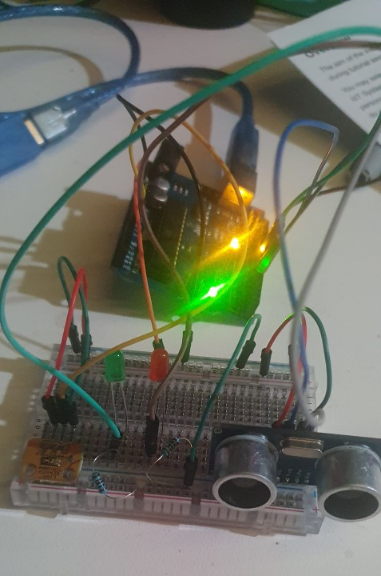

# Report

**Name: Keegan Pan**
**ID: 102145411**

## Summary 

For this assignment, I have created an automated chicken door which will open in the mornings to allow chickens out of thier coop. The idea leading to this came from when my father ordered an automated door from eBay, but it was not configureable and would open too early in the morning, this led the the loss of chickens as there was a fox waiting for them as dawn hit. If this was delayed, we would not have lost the chickens.

My strategy approaching this was to use a light sensor and ultrasonic sensor to detect the level of light and if there was a chicken waiting to leave to trigger the door opening and closing, the project is powered by and arduino and web server running on an Raspberry Pi, which allows the parameters to be configured, so the sensitivity can be adjusted if the light levels are too low or high, allowing us to trigger the door opening in regards to differenct levels of sunlight.


The implementation uses an HC-SR04 ultrasonic sensor and a TEMT6000 light sensor to detect object distance and light levels respectively, when the ultrasonic sensor detects an object close enough and the light sensor detects a light level high enough, a door is triggered to open, and then close a few seconds later. The door in my example is represented by an LED.
When an event is triggered, the data is sent via serial to the edge server to monitor when it happens, in a database we save the time, level of light and distance from when the trigger happens. Using the edge server we can configure the light level and distance level that will cause the trigger, this allows us to fine tune the triggering of the event.

### Resources

To use the HC-SR04 I followed this guide:
https://www.instructables.com/Simple-Arduino-and-HC-SR04-Example/

For the TEMT6000 light sensor I followed this guide:
https://learn.sparkfun.com/tutorials/temt6000-ambient-light-sensor-hookup-guide/all

I also used the examples for the Flask webserver from the class tutorials and made modifications to allow the control of the serial output to the arduino to allow modifying the sensitivity.
I also found snippets online for MySQL access using python, which I used to allow the webserver to display the information gathered.



### Code

#### Arduino Code

```arduino
////////////////////////////////////////////
//
// SWE30011 - Practical Assignment - Individual
// Name: Keegan Pan
// ID: 102145411
//
////////////////////////////////////////////

// This demo shows the usage of a Light Sensor and an Ultrasonic sensor
// to open a door when movement is detected,
// but only at a certain light level.

// Definitions

// Door LED
#define DOOR_OPEN_PIN 10
#define DOOR_CLOSE_PIN 11


// Ultrasonic Sensor
#define TRIG_PIN 7
#define ECHO_PIN 6
// Light Sensor
#define LIGHT_SENSOR_PIN A0

int cutoffDistance = 20;
int lightLevel = 20;
int usTrigger = 0;
int lightTrigger = 0;

void setup()
{
	pinMode(DOOR_OPEN_PIN, OUTPUT); // Green LED
	pinMode(DOOR_CLOSE_PIN, OUTPUT); // Red LED
	Serial.begin(9600);
	// Setup US Sensor
	pinMode(ECHO_PIN, INPUT);
	pinMode(TRIG_PIN, OUTPUT);

	// Setup Light Sensor
	pinMode(LIGHT_SENSOR_PIN, INPUT);
}

void loop()
{
	readSerial();

	int us = UltrasonicSensorLoop();

	int light = LightSensorLoop();

	if(us > 0 && us > cutoffDistance && light > lightLevel)
	{
		String output = String(us)+","+String(light);
		/*Serial.print(us);
		Serial.print(",");*/
		Serial.println(output);

		// Trigger door loop and send data to UI.
		//Serial.println("Door opening.");
		digitalWrite(DOOR_OPEN_PIN, HIGH);
		delay(5000);
		//Serial.println("Door open.");
		digitalWrite(DOOR_OPEN_PIN, LOW);
		delay(1000);
		//Serial.println("Door closing.");
		digitalWrite(DOOR_CLOSE_PIN, HIGH);
		delay(5000);
		//Serial.println("Door closed.");
		digitalWrite(DOOR_CLOSE_PIN, LOW);
		delay(1000);
	}

	delay(1000);
}
int UltrasonicSensorLoop()
{
	int duration;
	int distance;
	digitalWrite(TRIG_PIN, LOW);
	delayMicroseconds(2);
	digitalWrite(TRIG_PIN, HIGH);
	delayMicroseconds(10);
	digitalWrite(TRIG_PIN, LOW);
	duration = pulseIn(ECHO_PIN, HIGH);
	distance = (duration / 2) / 29.1;
	if (distance >= 200 || distance <= 0)
	{
		distance = -1;
		// Debug
		//Serial.print("D=-1");
		//Serial.print(",");
	}
	else
	{
		// Debug
		//Serial.print("D=");
		//Serial.print(distance);
		//Serial.print(",");
	}
	return distance;
}

int LightSensorLoop()
{
	int readLight = analogRead(LIGHT_SENSOR_PIN);
	// Debug
	//Serial.print("L=");
	//Serial.println(readLight);
	return readLight;
}

void readSerial()
{
	if (Serial.available() > 0)
		{
			// Read serial input
			String value = Serial.readString();
			if (value[0] == 'd')
			{
				// Change Distance
				String result = value.substring(1);
				cutoffDistance = result.toInt();
				Serial.print("Change distance: ");
				Serial.println(result);
			}
			else if (value[0] == 'l')
			{
				// Change Light
				String result = value.substring(1);
				lightLevel = result.toInt();
				Serial.print("Change light: ");
				Serial.println(result);
			}
		}
}
```

#### Python Webserver

```python
import serial
import pymysql
import time
import threading
import datetime
from flask import Flask, request, render_template

app = Flask(__name__)

# Dictionary of pins with name of pin and state ON/OFF
pins = {
    2 : {'name' : 'PIN 2', 'state' : 0 },
    3 : {'name' : 'PIN 3', 'state' : 0 }
    }
    
# Main function when accessing the website
@app.route("/")
def index():
    # TODO: Read the status of the pins ON/OFF and update dictionary

    
    #This data wii be sent to index.html (pins dictionary)
    templateData = { 'pins' : pins }

    data = showData()
    
    # Pass the template data into the template index.html and return it
    return render_template('index.html', **templateData, data=data)

@app.route("/", methods=['POST'])
def index_post():
    # TODO: Read the status of the pins ON/OFF and update dictionary
    if(request.form.get('light')):
        result = request.form['light']
        print("light")
        print(result)
        arduino.write(("l"+result).encode())

    if(request.form.get('distance')):
        result = request.form['distance']
        print("distance")
        print(result)
        arduino.write(("d"+result).encode())

    if(request.form.get('delete')):
        print("Deleting table.")
        delete()

    #This data wii be sent to index.html (pins dictionary)
    templateData = { 'pins' : pins }

    data = showData()
    
    # Pass the template data into the template index.html and return it
    return render_template('index.html', **templateData, data=data)

# Function with buttons that toggle depending on the status
@app.route("/<changePin>/<toggle>")
def toggle_function(changePin, toggle):
    # Convert the pin from the URL into an interger:
    changePin = int(changePin)
    # Get the device name for the pin being chnaged:
    deviceName = pins[changePin]['name']
    # If the action part of the URL is "on," execute the code intended below:
    if toggle == "on":
        #Set the pin high
        if changePin == 2:
            arduino.write(b"1")
            pins[changePin]['state'] = 1
        if changePin == 3:
            arduino.write(b"3")
            pins[changePin]['state'] = 1
        #Save the status message to be passed into the template:
        message = "Turned" + deviceName + "on."
    if toggle == "off":
        if changePin == 2:
            arduino.write(b"2")
            pins[changePin]['state'] = 0
        if changePin == 3:
            arduino.write(b"4")
            pins[changePin]['state'] = 0
        #Set the pin low
        message = "Turned" + deviceName + "off."
    
    #This data wii be sent to index.html (pins dictionary)
    templateData = { 'pins' : pins }

    data = showData()
    
    # Pass the template data into the template index.html and return it
    return render_template('index.html', **templateData, data=data)

#Function to send simple commands
@app.route("/<action>")
def action(action):
    if action == 'action1':
        arduino.write(b"1")
        pins[2]['state'] = 1
    if action == 'action2':
        arduino.write(b"2")
        pins[2]['state'] = 0
    if action == 'action3':
        arduino.write(b"3")
        pins[3]['state'] = 1
    if action == 'action4':
        arduino.write(b"4")
        pins[3]['state'] = 0
    
    #This data wii be sent to index.html (pins dictionary)
    templateData = { 'pins' : pins }

    data = showData()
    
    # Pass the template data into the template index.html and return it
    return render_template('index.html', **templateData, data=data)


def delete():

    cursor = dbConn.cursor()
    cursor.execute("DELETE FROM doorLog where ID > 0")
    dbConn.commit()
    cursor.close()

    cursor = dbConn.cursor()
    cursor.execute("ALTER TABLE doorLog AUTO_INCREMENT = 1")
    dbConn.commit()
    cursor.close()

def readThread():
    while 1:
        data = arduino.readline().decode('ASCII')
        if(len(data)>0):
            print(data)
            if "," in data:
                splitData = data.split(",")
                print(len(splitData))
                if(len(splitData) >= 2):
                    if(len(splitData[0]) > 0 and len(splitData[1]) > 0):
                        cursor = dbConn.cursor()
                        cursor.execute("INSERT INTO doorLog (time, light, distance) values (\'{0}\', \'{1}\', \'{2}\')".format(datetime.datetime.now(), splitData[1].strip(), splitData[0].strip()))
                        dbConn.commit()
                        cursor.close()
                        print("Insertion successful")
                        time.sleep(1)

def showData():
    cur = dbConn.cursor()
    cur.execute("select * from doorLog")
    dbConn.commit()
    cur.close()
    return cur.fetchall()

# Main function, set up serial bus, indicate port for the webserver,
# ans start the service.
if __name__ == '__main__':
    arduino = serial.Serial('/dev/ttyACM0', 9600, timeout = 1)
    arduino.flush()
    dbConn = pymysql.connect(host="localhost",user="pi",password="",database="door_db") or die("Cannot connect to database")
    x = threading.Thread(target=readThread)
    x.start()
    app.run(host='0.0.0.0', port = 80, debug = True)
```

##### HTML

```html
<!DOCTYPE html>
	<head>
		<title>Automated Chicken Door</title>

	<style>
		table, th, td {
  			border: 1px solid black;
			border-collapse: collapse;
			padding: 10px 50px;
		}
	</style>
	</head>
	<body>
		<h1>Automated Chicken Door</h1>

		<form action="/">
			<input type="submit" value="Refresh Page">
		</form>

		<br />

		<form action="/" method="POST">
			<label>Set Light Value (0-1023)</label>
			<input type="number" name="light">
			<input type="submit" value="Update">
		</form>

		<br />

		<form action="/" method="POST">
			<label>Set Distance Value (0-200)</label>
			<input type="number" name="distance">
			<input type="submit" value="Update">
		</form>

		<br />

		<form action="/" method="POST">
			<input type="submit" name="delete" value="Clear Table">
		</form>

		<br />
	
		<h3>Triggered Door Events</h3>

		<table>
			<tr>
				<th>Time</th>
				<th>Light</th>
				<th>Distance</th>
			</tr>
			
			
			<tr>
				<td>{{row[1]}}</td>
				<td>{{row[2]}}</td>
				<td>{{row[3]}}</td>
			</tr>
			
			
		</table>
			
	</body>
</html>
```